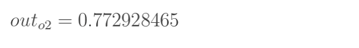
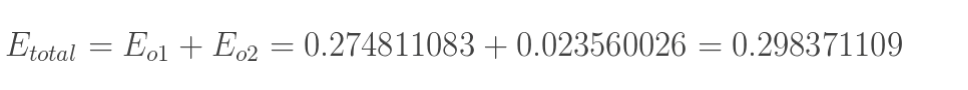
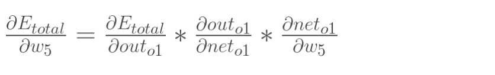
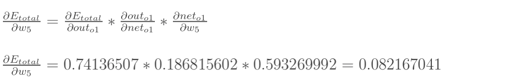
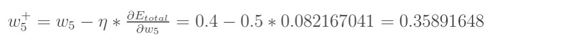

# 深度神经网络

- 输入层：神经网络的第一层叫做[输入层](https://zhida.zhihu.com/search?content_id=223290266&content_type=Article&match_order=1&q=输入层&zhida_source=entity)，输入层所含的神经元个数等于单个实例所包含的特征数，**输入层只负责输入数据，没有激活函数。**
- 隐藏层：
  - **中间所有层**都叫做隐藏层
  - 隐藏层的作用是**提取特征**，靠前的隐藏层负责提取一些**简单特征**，越靠后的隐藏层提取的**特征越复杂**，隐藏层**必须包含激活函数**。
- 输出层：输出层所包含的**神经元数目**与**标签的类别数相关**，输出层负责输出**模型的预测值**，**可以包含激活函数**。

**模型结构的神经元个数 ，输入层、输出层的神经元个数通常是确定的**，主要需要考虑的是**隐藏层的深度及宽度**，在忽略网络退化问题的前提下，通常隐藏层的神经元的越多，模型有更多的容量去达到更好的拟合效果。

## 神经元

多个输入通过连接传至人工神经元，在人工神经元内部被施加**一次计算加权和的线性变换**和**一次称为激活功能的非线性变换**（激活函数），最后再通过连接被输出

其中$x$为输入，带线条的线称为连接，负责传递信息，每一个连接上都有一个权重$w$ 。中间的节点为人工神经元节点，其中$\delta$是一个非线性变换，称为激活函数，施加激活函数的目的是为了**使人工神经元具有表示非线性关系的能力**。参数$b$称为偏置，output为人工神经元的输出。**该模型包含m个输入和1个输出**，神经元内部包含**1个线性变换和1个非线性变换**:
$$
\text{output} = \delta ( \sum_{j=1}^{m} w^j x^j + b)
$$

## 激活函数

激活函数的作用是使神经元具有表示非线性关系的能力，使模型可以**拟合数据中的非线性关系**，从而**解决众多的非线性问题**，它将求和结果映射到所需范围，这有助于确定神经元是否需要被激发。

### 激活函数一般需要具备以下几个特点：

- 非线性，激活函数**如果是线性函数，将会与单层感知机无异**
- 可微性，进行训练时**基于梯度的优化**方法需要激活函数**必须可微**；
- 单调性，保证了模型简单

### 常见激活函数

#### Sigmoid：

值域类似于概率，适用于二类分类问题的输出层。

**使用条件：**

- 值域非零对称（非原点对称），会减缓收敛速度。
- 可能出现梯度消失问题。
  - Sigmoid 函数的一阶导数的最大值为 0.25，在非常深的深度神经网络中计算损失函数关于浅层权重和偏置的梯度时，会用到链式法则，这样就会出现多个很小的数相乘的情况，使得梯度接近于 0，这就是梯度消失问题。
- 公式包含幂运算，**时间复杂度较高**

#### Tanh

Sigmoid 的优化版本，解决了非零对称问题，一阶导数的值域范围更大，更不容易出现梯度消失问题

**使用条件：**

- 时间复杂度较高。
- 仍然存在出现梯度消失问题的可能

#### ReLU

x>0 时，ReLU 函数的导数恒为1，解决了梯度消失问题。无指数运算，计算量小，收敛速度快。

**缺点：**

- 未解决非零对称问题。
- 可能出现神经元坏死问题（Dead ReLU Problem）：当x<0时，ReLU 函数的梯度恒为0，**导致这些神经元坏死而不再被激活**。

## 损失函数

在训练模型的过程中，需要**衡量这一个模型的参数是好还是坏**，而衡量这一个模型参数的好坏就是看输出的损失。

训练模型的过程中，会输出这一个**模型的预测标签**，这一个预测标签和**这一个图片的真实标签的差异**就是我们所说的**损失**。

损失函数是深度学习中的一个关键因素，它可以帮助我们评估模型的性能并且**用于调整模型的参数**。选择合适的损失函数能够提高模型的性能，并有助于解决复杂的问题。

## 参考文档

> - [深度神经网络的结构](https://zhuanlan.zhihu.com/p/608212097)

# 反向传播算法

第一层是输入层，包含两个神经元i1，i2，和截距项b1；第二层是隐含层，包含两个神经元h1,h2和截距项b2，第三层是输出o1,o2，每条线上标的wi是层与层之间连接的权重，激活函数我们默认为sigmoid函数。

需要利用方向传播算法计算 $w_i$和 $b_i$的值。

一共包含三步，向前传播，反向传播，隐含层的权值更新。

## stap1 向前传播

计算输出层神经元o1和o2的值

这样前向传播的过程就结束了，我们得到输出值为[0.75136079 , 0.772928465]，**与实际值[0.01 , 0.99]相差还很远**，现在我们对误差进行**反向传播**，更新权值，重新计算输出。

## step2 反向传播

### **1. 计算总误差**

### **2. 输出层的权值更新**

以权重参数w5为例，如果我们想知道w5对整体误差产生了多少影响，可以用**整体误差对w5求偏导求出**：（链式法则）

同求偏导得到对应参数的导数：

更新$w_5$的值：

（其中，是**学习速率**，这里我们取0.5)

所有的参数也是这样同理计算优化迭代。

这样误差反向传播法就完成了，最后我们再把更新的权值重新计算，不停地迭代，在这个例子中第一次迭代之后，总误差E(total)由0.298371109下降至0.291027924。迭代10000次后，总误差为0.000035085，输出为[0.015912196,0.984065734](原输入为[0.01,0.99]),证明效果还是不错的。

## 参考文档

> - [[一文弄懂神经网络中的反向传播法——BackPropagation](https://www.cnblogs.com/charlotte77/p/5629865.html)](https://www.cnblogs.com/charlotte77/p/5629865.html)