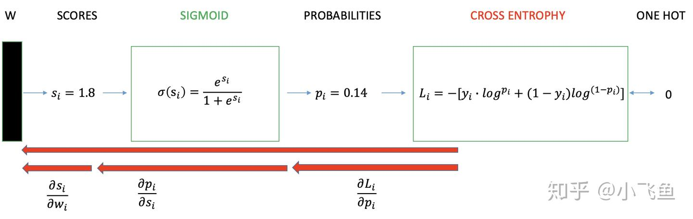

# 交叉熵损失函数(cross-entropy loss)

常用于损失函数的分类问题中，对于分类问题特别有效。

交叉熵形式：
$$
L = - y_i \log p_{i}
$$

## 二分类激活函数

对于二分类的**sigmoid激活函数**，其损失函数形式为：
$$
L_i = - [ y_i (\log p_{i}) + (1-y_i)\log p_{i} ]
$$
连续求导过程如下图所示：

## 多分类激活函数

对于多分类的**softmax激活函数**，其损失函数形式为：

$p_i$是正确类别对应的输出节点的概率，当然希望**此时的越大越好**（当然最大不能超过1）。通常情况下使用梯度下降法来迭代求解，因此只需要为**$\log p_i$加上一个负号变成损失函数**，现在变成希望损失函数越小越好：

> $p_i$为1时候，损失函数为0，$p_i$ 不为1时候梯度爆炸，梯度更大更容易趋向于1

$$
loss_i = -\log p_i = -\log{\frac{e^{z_i}}{\sum_{c=1}^{C}e^{z_{c}}}} = -(z_i - \log \sum^C _{c=i} e^{c})
$$

一般来说交叉熵是下面这个函数：
$$
L = - \sum ^C _{c=1} y_c (\log p_{c})
$$

> 那么一般的**损失函数和交叉熵函数**有什么关系呢？为什么说softmax一般的**损失函数是交叉熵函数**？

对于分类任务来说，真实的**样本标签通常表示为one-hot的形式（$y_c$）**。比如对于三分类来说，真实类别的索引位置为1，也就是属于第二个类别，那么使用**one-hot编码表示为[0, 1, 0]，也就是仅正确类别位置为1，其余位置都为0**。而式子2中的 就是真实样本的标签值，将[0, 1, 0]代入式子2中即 ：
$$
L = - \sum ^C _{c=1} y_c (\log p_{c}) = -0\times \log p_{0} -1\times \log p_{1} -0\times \log p_{2} 
$$
进一步和$loss_i$做比较，可以发现两个式子是一样的：
$$
loss_1 = -\log{\frac{e^{z_1}}{\sum_{c=1}^{C}e^{z_{c}}}}  =-\log p_1 = L
$$

详细见[softmax 激活函数](./激活函数.md#Softmax 函数#损失函数)

## 优缺点：

优点：

- 使用逻辑函数得到概率，并结合交叉熵当损失函数时，在模型效果差的时候学习速度比较快，在**模型效果好的时候学习速度变慢**。

缺点：

- 随着分类数目的增大，分类层的线性变化矩阵参数也随着增大；
- 对于封闭集分类问题，学习到的特征是可分离的，但对于开放集人脸识别问题，所学特征却没有足够的区分性。
- sigmoid(softmax)+cross-entropy loss 擅长于学习类间的信息，因为它采用了类间竞争机制，它**只关心对于正确标签预测概率的准确性**，**忽略了其他非正确标签的差异**，导致**学习到的特征比较散**。基于这个问题的优化有很多，比如对softmax进行改进，如L-Softmax、SM-Softmax、AM-Softmax等。

## 参考文档

> - [损失函数｜交叉熵损失函数](https://www.zhihu.com/tardis/zm/art/35709485?source_id=1003)
> - [softmax 激活函数](./激活函数.md#Softmax 函数#损失函数)

