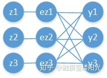
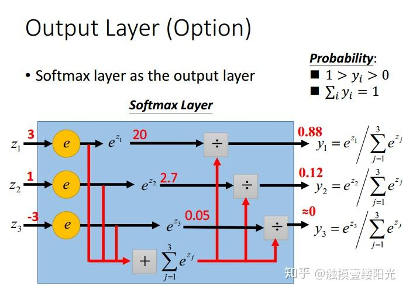
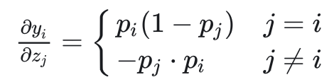

# Softmax 函数

**一般用于输出层的分类。**

Softmax的核心在于soft，而soft有软的含义，与**之相对的是hard硬。**

找出数组所有元素中值**最大的元素**，实质上都是求的hardmax。

hardmax最大的特点就是**只选出其中一个最大的值**，即非黑即白。

soft的概念，Softmax的含义就在于**不再唯一的确定某一个最大值**，而是为**每个输出分类的结果**都赋予一个**概率值**，表示属于**每个类别的可能性**。

softmax 的函数定义如下：
$$
\text{softmax}(z_i) = \frac{e^{z_i}}{\sum_{c=1}^{C}e^{z_{c}}}
$$


Softmax函数可以将多分类的输出值转换为**范围在[0, 1]和为1的概率分布**。

## softmax层函数示意图

一般softmax使用于输出层中。

三个输出的softmax激活函数示意图：



## 



## 优缺点

指数函数（$y = e^x$）曲线呈现加速递增趋势，在x轴上一个很小的变化，可以导致y轴上很大的变化。

- 经过使用指数形式的Softmax函数能够将**差距大的数值距离拉的更大**
- 反向传播求导方便：$(e^x)' = e^x$

**缺点：**

- 可能存在数值溢出（减去输出值中的最大值就可以解决）

  - > ```python
    > import numpy as np
    > 
    > scores = np.array([123, 456, 789])
    > softmax = np.exp(scores) / np.sum(np.exp(scores))
    > print(softmax) # [ 0.  0. nan]
    > ```


## 激活函数

当使用Softmax函数作为输出节点的激活函数的时候，一般使用**交叉熵**作为损失函数。


## 求导

对于Softmax函数的梯度推导依然使用的是导数的基本运算，并不复杂。最关键的是要对 以及 两种情况分别讨论。偏导数的最终表达式如下，其中使用$p_i$来表示$\text{softmax}(z_i) = \frac{e^{z_i}}{\sum_{c=1}^{C}e^{z_{c}}}$:



## 损失函数

$p_i$是正确类别对应的输出节点的概率，当然希望**此时的越大越好**（当然最大不能超过1）。通常情况下使用梯度下降法来迭代求解，因此只需要为**$\log p_i$加上一个负号变成损失函数**，现在变成希望损失函数越小越好：

> $p_i$为1时候，损失函数为0，$p_i$ 不为1时候梯度爆炸，梯度更大更容易趋向于1

$$
loss_i = -\log p_i = -\log{\frac{e^{z_i}}{\sum_{c=1}^{C}e^{z_{c}}}} = -(z_i - \log \sum^C _{c=i} e^{c})
$$


一般来说交叉熵是下面这个函数：
$$
L = - \sum ^C _{c=1} y_c (\log p_{c})
$$

> 那么一般的**损失函数和交叉熵函数**有什么关系呢？为什么说softmax一般的**损失函数是交叉熵函数**？

对于分类任务来说，真实的**样本标签通常表示为one-hot的形式（$y_c$）**。比如对于三分类来说，真实类别的索引位置为1，也就是属于第二个类别，那么使用**one-hot编码表示为[0, 1, 0]，也就是仅正确类别位置为1，其余位置都为0**。而式子2中的 就是真实样本的标签值，将[0, 1, 0]代入式子2中即 ：
$$
L = - \sum ^C _{c=1} y_c (\log p_{c}) = -0\times \log p_{0} -1\times \log p_{1} -0\times \log p_{2} 
$$
进一步和$loss_i$做比较，可以发现两个式子是一样的：
$$
loss_1 = -\log{\frac{e^{z_1}}{\sum_{c=1}^{C}e^{z_{c}}}}  =-\log p_1 = L
$$


### 反向传播：

如果需要反向传播，则需要对交叉熵函数进行$z_i$求偏导，可以得到：（省略详细求导过程）
$$
\frac{\part L}{\part z_i} = p_{i} - y_{i}
$$


**总的概括Softmax+交叉熵损失函数参数更新为"推所有，拉一个"。**

增大想要的压缩不想要的。

## 参考文档

> - [一文详解Softmax函数](https://zhuanlan.zhihu.com/p/105722023)