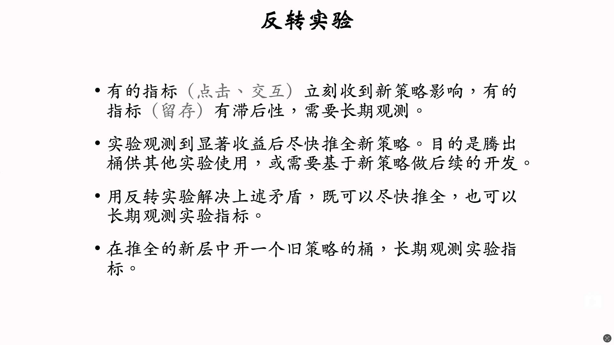
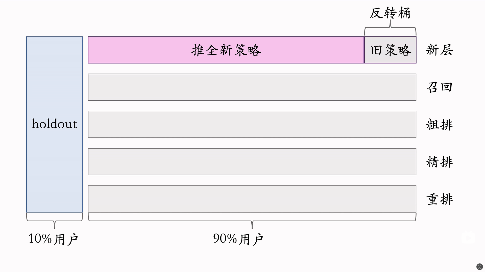
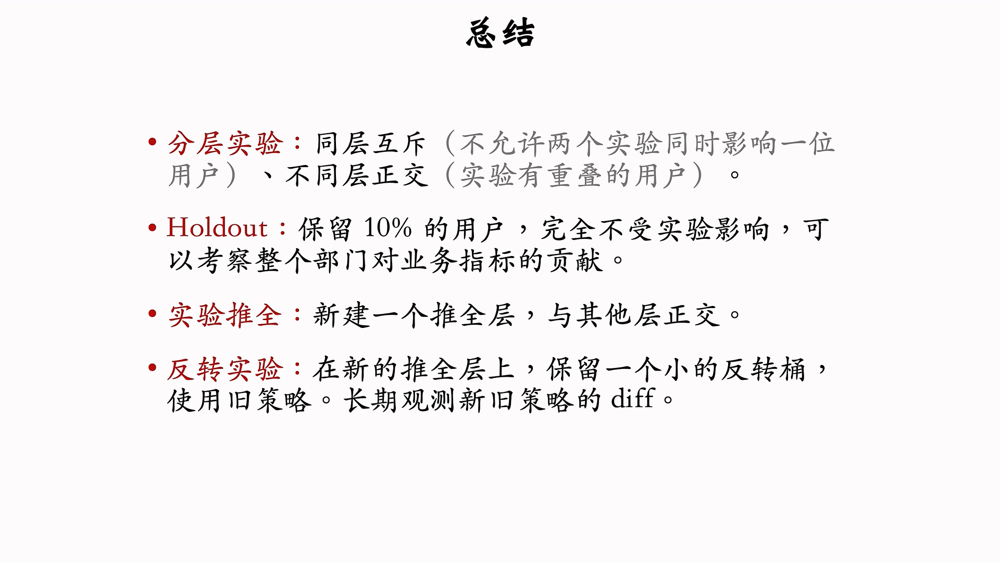

# 推荐系统完整链路

## 粗排和精排

这两个相似

下图是对当篇文章的排序打分

## 总结

# AB测试

## 分桶实验

## 分层实验

主要解决流量不够用的问题，很多实验在同时进行，那么怎么解决用户重叠导致的实验结果被影响的问题呢？

### 同层互斥和不同层正交

#### 不同层正交的含义

将每一个步骤分为不同的层，不同层的用户随机分配到下一层中。

### 为什分为正交和互斥两种策略组

 

比如说召回和粗排是两个不同的层，他们之间正交。各自做实验不会影响下一层的结果。只需要观察各自层的指标即可。

> **弹幕上下层之间是否会产生影响解答：**
>
> 在优化每一个层的时候，先只观察当前层的指标是否有提升。对于结果会随机打散到下一层中，让下一层中的每一组实验收到的影响应该是一致的，所以不会影响下一层的实验。
>
> 对于推全之前判定是否会上层改进会对下层产生影响，应该增加一个组合验证的环节来验证。

## Holout机制

- 使用 holdout 桶来作为优化的对照组，对照当前的效果如何

## 实验推全和反转实验

### 反转实验

- 存在滞后性指标和长期性指标，之间互斥，因为推进实验需要流量
- 需要反转实验解决这个问题

- 使用 holdout 和反转桶之间的相互交换来保留旧策略观察长期指标

## 总结

