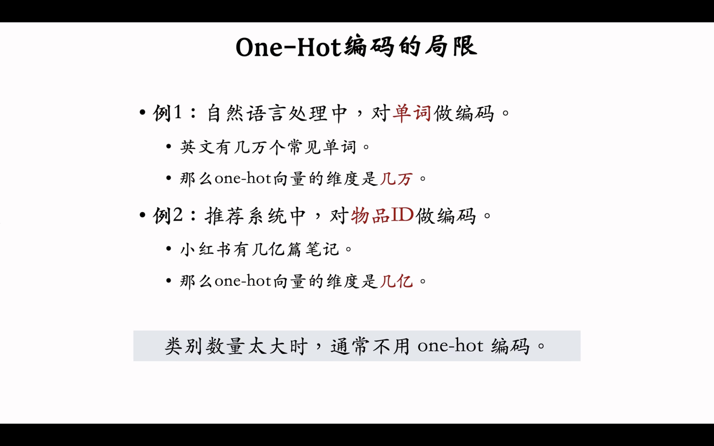
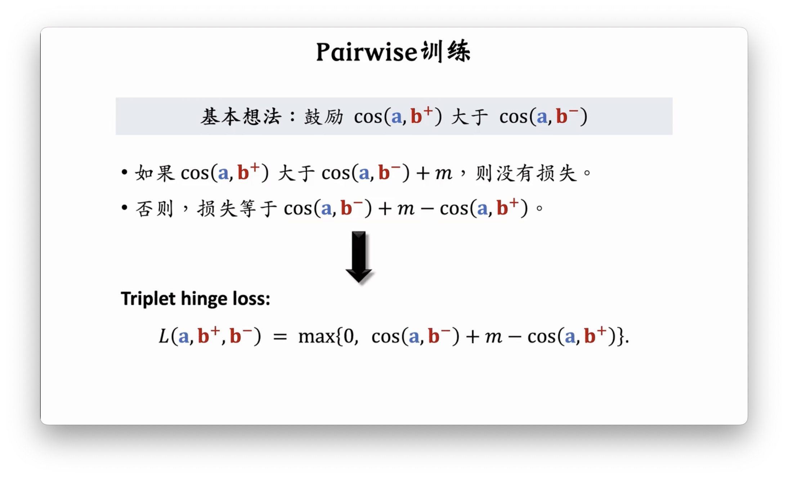
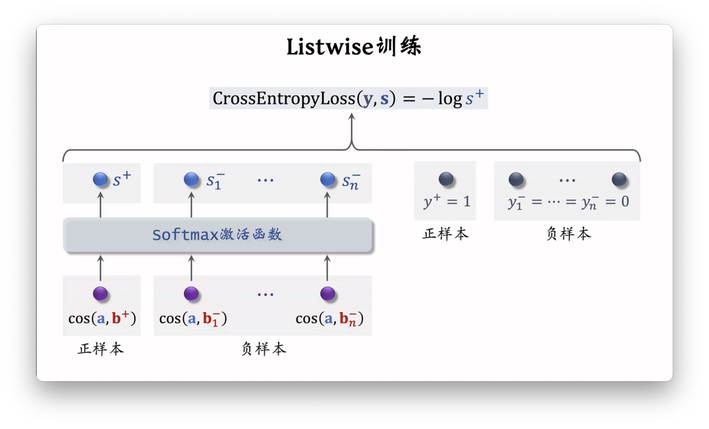
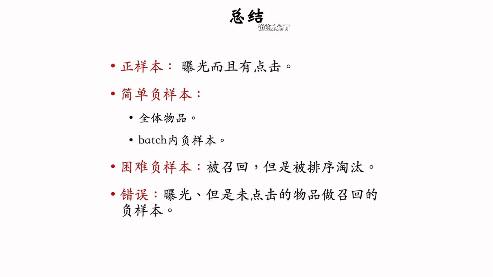
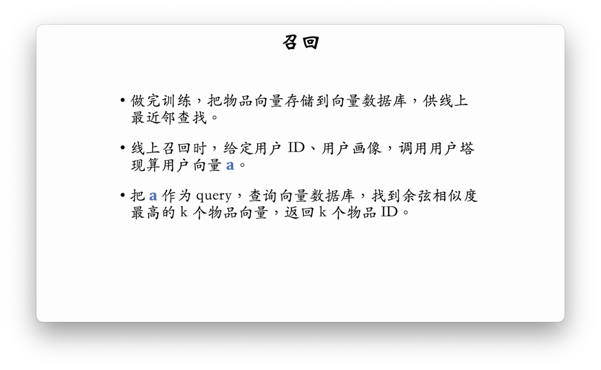
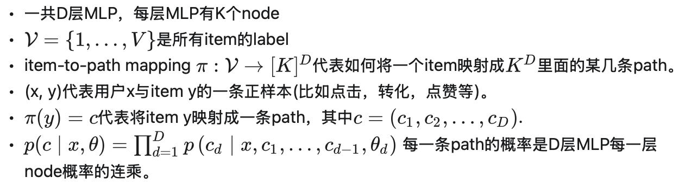
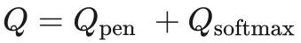

# 1.基于物品的协同过滤（ItemCF）

**主要作用：**

基于物品的相似性做推荐。使用用户感兴趣的物品和物品之间的相似度，找到用户可能感兴趣的潜在物品，使用该方法会存在两个假设：

- 如果喜欢$i_1$和$i_2$受众重叠程度高，那么可以认为这两个物品相似
- 喜欢$i_1$的用户也有很大可能喜欢$i_2$

## 如何计算两个物品相似度

两个物品之间的受众相似度非常高，可以认为两个物品相似。

 

## 总结

## 如何将 ItemCF 应用到召回中

### 先做离线计算

### 线上召回

离线计算量大，线上计算量小

### ItemCF召回通道

## ItemCF存在的问题

- 小圈子问题，由于小圈子里面的人能同时接触到不相关的内容，从而错误判断两个内容是相似的。所以使用 ItemCF 的时候需要注意找到的用户交集是不相关的离散的用户，而不是来自于一个小圈子的用户。这个问题可以使用 Swing 来解决。

# 2.Swing

**主要作用：**

- 优化 ItemCF 中小圈子带来的不相关判定相似的影响

- 改进了 ItemCF 中物品相似度的计算方法，加入两个物品之间喜爱物品相重合度的考虑

 

## 总结

# 3.UserCF

- 基于用户的相似，找到兴趣相似的人爱好来推荐的笔记。
- 如果用户$u_1$和$u_2$兴趣相似，那么$u_2$喜欢某物品，那么$u_1$也可能喜欢某物品，这两个用户之间的喜欢的物品会有很大的重合

## 如何计算两个用户之间的相似度

- 排除热门物品的对于判断相似兴趣的影响，因为热门物品不同圈子的人也可能会喜欢。

## 数学原理总结

- 把用户表示胃一个稀疏的向量，向量中的每一个值表示的是 1 喜欢这个物品，或者是经过去热门化处理后的权重

## 执行召回的完整流程

### 离线计算索引

- 用户到物品的索引，找到感兴趣额的物品列表，和 ItemCF 相同
- 用户到用户的索引，可以找到最相似的 K 个用户

### 线上实时推荐

 

# 4. 离散特征处理

 分为两步：

1. 建立字典
2. 向量化

## One-hot编码

- 字典多少种类别，向量就多少维。
- 对应向量位置为 1。

### 局限性

## Embedding

- 什么是 Embedding 层？
  - 下面的参数矩阵

## Embeding和One-Hot 的关系 

- 参数矩阵的某一列就是对应的 Embedding

## 总结

# 矩阵补充

## 矩阵补充模型结构

用户和物品的 Embedding 的内积，就是模型的输出。

- 主要作用是利用现有的用户和物品的兴趣度，来预测补充用户没曝光过的物品的兴趣。

## 矩阵补充模型的训练

 

## 矩阵补充的问题

## 线上服务

### 最近邻查找

#### cosine相似度

余弦相似度是两个向量之间的夹角。

先分开成多个大类，使用 KNN 的方法，先去搜索相似的大类，再搜索区域内的所有数据。

# 双塔模型

## 用户的表征

- 将特征拼接起来输入神经网络，得到用户的特征。

## 物品的表征

- 与用户的表征类似，得到某一个物品的特征向量
- 可以理解为一个新的 Embedding？

## 双塔模型

- 两个模型的内积就是一个向量，表示的是用户对于一个物品的兴趣。

## 双塔模型的训练

 

- 训练用户表征和物品表征的深度学习模型

### 如何选择正负样本？

### Pointwise训练

### pairwise训练

- 训练的时候每一组数据都是三元组。一个用户对应一个正样本物品和负样本物品。
- 希望损失函数越小越好。

### listwise 训练

- 使用一个正样本对应一堆负样本。尽可能让正样本的概率接近 1，其他接近 0。
- 最小化交叉熵作为代价函数。

## 总结

## 不适用于召回的模型

- 属于前期合并，在经过神经网络之前就进行了合并。**前期模型都是排序模型，不是召回模型。召回只可以使用前期融合的双塔模型。**
- 计算的时延不满足。物品的神经网络计算也是在线计算，当物品数量多的时候，不可能满足时延要求。

# 双塔模型：正负样本

## 选取正样本时候需要考虑的问题

都是正样本（用户感兴趣），但大多数的点击都是集中在某种物品中，少部分的物品所占据点击少，容易在训练的时候被边缘化。

#### 推荐系统语样本选取的目标：

> #### 为什么需要区分热门物品和冷门物品呢？？？
>
> 1. 防止正样品都是热门物品，需要降采样热门物品，冷门物品也能作为正样品
> 2. 防止负样品都是冷门样品，需要过采样热门物品。因为冷门样品比较少被选中或者点击，所以很多时候冷门物品会被训练成误认为是不感兴趣。
>
> 希望训练出来的模型是综合包含热门物品和冷门物品的，提升系统推荐物品的多样性。

## 如何选择负样本

### 选择负样本的原理与目标

召回仅仅是大粒度地去找到用户可能感兴趣的物品，训练召回模型的时候也是尽可能地召回感兴趣的物品。

 

### 全体物品负样本

- 为了负样本中多点热门物品，正样本中多点冷门物品
- 所以负样本的抽取概率是和点击次数呈现正相关

### Batch 内负样本 

在一个batch里面随机采样一定比例的除本item外其它的item作为user的负样本，这种方式的优点就是占用资源少，样本pipline简单。

在工程上，对于 Batch 内负样本采样不会进行**热度降权采样**，原因有下：

1. Batch 中的样本数量本身就不多
2. Batch 中的样本大多都是热门样本（热门才会容易被点击），所以其 Batch 内负样本中大多都是热门物品

  

- 为什么不点击的就是不感兴趣的呢？？？

>参考材料：
>
>- [双塔模型Batch内负采样如何解决热度降权和SSB的问题 - MECH的文章 - 知乎](https://zhuanlan.zhihu.com/p/574752588)

​                

### 困难负样本

苦难负样本的定义：

- 在召回的过程中被误判断为正样本的负样本，对**召回步骤来说难辨别**
- 有的在粗排之后被分辨出来，有的是在精排之后才会被分辨出来。
- 将这些困难负样本分辨出来比较困难。

#### 工业界设置负样本的方法

- 混合负样本处理
- 50% 是全体中抽样出来的**全体物品负样本**
- 50% 是在召回和精排的过程中被过滤出来的物品作为**困难负样本**

### 负样本设置常见错误

- **召回**目标是找到用户可能感兴趣的物品
- 用户感兴趣和用户非常感兴趣不是在**召回**的处理过程中
- **有曝光没点击**区分的是用户感兴趣和非常感兴趣这部分，这部分的任务是在排序步骤中处理的

## 总结

# 双塔模型的线上召回和更新

## 线上召回的过程

### 为什么需要这样设计？

### 全量更新

- 在之前的基础上做训练，希望新的模型能够拟合昨天增加的新数据

>### 什么是1Epoch？
>
>**1个epoch = 完整学习一次全部数据**：假设训练集有*N*个样本，1个epoch表示模型用所有*N*个样本完成一次训练迭代
>
>**与Batch和Iteration的关系**：
>
>- **Batch Size**：每次输入模型的样本数量（如100个样本/批次）。
>- **Iteration（迭代次数）**：1个epoch内需完成的批次数量，计算公式为：
>  Iterations per Epoch=Batch SizeTotal Samples​
>   例如，10,000个样本，Batch Size=100，则1个epoch需要100次迭代
>
>**1个epoch的训练流程**
>
>1. **数据分批**：将数据集划分为多个Batch。
>2. **前向传播**：计算当前Batch的预测值。
>3. **损失计算**：比较预测值与真实标签的误差。
>4. **反向传播**：计算梯度并更新模型参数。
>5. **重复**：直到所有Batch处理完毕，1个epoch结束

### 增量更新

### 全量和增量更新的区别

- 全量模型的随机训练可以得到更好的优化结果
- 全量更新的模型更好
- 增量更新可以实时优化模型

# 双塔模型总结

## 双塔模型

## 召回的流程

## 更新模型的方式

# 双塔模型自监督学习

目标：训练双塔模型的物品塔

## 双塔存在问题

 

> ### 什么是长尾物品？
>
> 销量较小、种类繁多、通常不被主流市场重视的商品或服务。
>
> 在传统经济中，依赖20%的热门产品创造80%利润。
>
> 在互联网中，尾部商品的总和可能超越头部市场，长尾物品体现了互联网时代“小众即大众”的经济逻辑，通过技术手段挖掘被忽视的需求价值

## listwise 训练双塔模型

目标：

- 训练**用户-物品**之间的预测概率，提高双塔模型对于用于偏好物品的推荐精度
- 使用纠偏打压热门物品，提高长尾物品的推荐效果

### 损失函数

- 目标：正样本的概率为 1，其他的概率为 0
- 方法：构建交叉熵的损失函数等于对应的目标向量$y_i$

### 纠偏

目标：为了减少热点物品对于长尾物品的打压，需要在训练的时候对其进行打压。

- **注意：**只有训练的时候需要进行纠偏，在线上预测的时候不需要进行纠偏

###  训练

- n 表示的是 n 个用户 
- 最小化 n 个用户的预测正样本的和来作为总损失函数来优化双塔模型。

## 自监督学习（对比学习）

目标：

- 训练的目标是物品塔
- 推荐系统中存在严重的头部效应，即少数热门物品占据大部分点击，而大量**长尾物品**（低曝光，新物品等）因**数据稀疏导致其表征学习不充分**
- 希望通过特征变换生成同一物品不同视图的方式，强制**物品塔**学习到物品的**不变性特征**，使得物品在不同的特征空间中都可以保持高度的相似性，**增强长尾物品的表征鲁棒性**

### 训练策略

- 使用不同的特征变换，来增强特征的表征
- 配合不同特征变换得到的物品向量来参与优化。

### 特征变换的类型

#### Random Mask

- 随机丢掉一部分的特征

#### Dropout

- 丢掉一半的特征，还会保留一部分的特征

#### 互补特征

#### Mask 一组关联特征

希望模型可以从存在的特征中学习到关联的特征

- 计算两个特征之间的相似性
- 只保留**最不相关**的一半特征

### 训练模型

#### 自监督部分损失函数

### 自监督学习总结

## 双塔模型自监督学习训练

- 抽取两组训练模型，一组（点击Batch样本）用于双塔模型的训练，一组（物品随机样本）用于自监督模型的训练
- 将两组的损失函数相加
- 联合提高长尾物品的特征表征与双塔模型对长尾模型的推荐效果

# Deep Retriaval

> 参考文档：
>
> - [[召回|CIKM2021|ByteDance]字节跳动深度召回模型论文精读(Deep Retrieval)](https://zhuanlan.zhihu.com/p/440156847)

## 方法特点：

- 双塔模型 用户和物品之间的联系是分开的，只有在最后内积时候才会产生联系，
- 该方法可以提高用户与物品之间的联系，提高长尾物品的召回率

## 整体架构流程

这个模型一共包含两部分：

1. 表示路径的 D 层 MLP 模型
2. Item-to-path 的映射索引

​	召回过程包含 DR 和 rerank 两部分。在 DR 之后可能候选的召回集比较大，所以需要经过 rerank 来过滤一遍。也就是把前面 DR 过滤出来的召回集作为输入，论文中使用的是 softmax 模型去学习。选出 TopN 送到下一步的粗排和精排步骤中。

## 方法 OutLine

## DR 的实现

### 参数定义

### 1. D 层 MLP 模型

#### 模型结构

使用多层 MLP计算，并且将每一层的 MLP 计算结果与用户特征和前面一层计算出来的 Embedding 进行一个$Concat$ 处理，得到新的特征向量放到下一层MLP，最后可以得到对应的 Path 及其映射的 Item 集。

#### 模型训练（E-Step）

1. 对于该模型的学习，这里我们首先固定path的学习，也就是假设**已知 Item 映射的 Path  $\pi(y_{i})$** (初始使用随机映射)。对于给定的的N条样本的训练集, 对于每种 Item 一条path的最大log 似然函数为:

2. 但是由于每一个物品只映射到一个路径中是不够的。因为巧克力可以是“food”，也可以是“gift”，因此作者将一个item映射到J个path里面，所以需要映射到$J$个 path 里面：

​	详细过程如下：

3. 但是这样也会导致了一个所有物品都映射到一个路径中就会得到最小代价的问题。所有的物品都是在一个路径分类中，就会出现所有物品都召回回来的失败情况。为了可以让物品可以平摊分布在所有的路径中，提高对于长尾特征路径的鲁棒性，则需要对路径物品的数量进行打压：

4. 联合之前的rerank学习，最后的loss就是

### 2. Beam search

暴力计算保留所有的 path，会导致候选集数量过多，时间复杂度过高。

论文中使用 BeamSearch 的方式来平衡搜索时间和召回结果。

在 Beam Search 的 size 为 1 的时候：

- 贪心和选出来的未必是最优的，动态规划又是 $K^3$的时间复杂度
- 所以需要合理控制 beam search 的大小

通过选取最优的 Top N 个输出路径，并且以其路径中映射到的 Item 集作为召回的结果。

### 3. item-to-path learning 

#### item与path 表征

一个 item 如何确定去哪几个 path？

使用 EM 的形式交替优化，在第$t$个 epoch：

1. 先锁住映射物品和路径的映射不变，优化神经网络一次
2. 锁住神经网络不变，更新物品与路径的映射

#### E-step  

见上面[模型训练（E-Step）](#模型训练（E-Step）)。

#### M-Step

最简单的方式是暴力，枚举所有的 $K^D$路径，找到Top$J$。但是这是不可能的。

具体来说：

1. 计算样本集中 user 在神经网络中计算得到的某一条路径 path 的概率$p(\text{path}|\text{user})$，并根据是否点击某个$\text{item}$（0 或 1）得到这个$\text{item}$和该路径 path 的相关性分数$score(\text{item},\text{path})$。

   

2. 最优的方法是循环迭代，从不在现有集合中选出一条分数 score 高的路径。且为了防止长尾路径被打压，太多物品集中在某一个路径中。所以需要使用对应 path 下面映射的 item 数量来打压，作为纠偏项$\text{reg}(\text{path}_{j})$，加入到集合中。最后选择出 Top$J$条 path 作为 item 的路径。

   

   

    

#### 伪代码表示的算法流程如下

对于第i步，选择第i 条映射的收益为：

因此我们就从i=1开始每次贪心的选择增益最大的最为当前path。作者指出，3到5次迭代就足以保证算法收敛。时间复杂度随词汇量V、路径多样性J和候选路径数量S呈线性增长。

### 训练总结

## 线上召回流程

## DR 流程总结

- 本质是路径作为物品和用户之间的中介
- 双塔是使用向量表征作为物品和用户之间的中介

# 个性化的召回通道

# 曝光过滤（布隆 Bloom 过滤）

目标：消除重复内容推荐给用户

## 布隆过滤器

### 过滤器特点

### 实现

#### 哈希函数的数量为 1：

#### 哈希函数的数量为 3：

#### 性能分析

- 误伤的概率最低可以到达 1%

## 曝光过滤的链路

- 曝光服务向召回服务提供当前用户的二进制，用于比对曝光情况。
- 曝光服务只有在曝光后的实时流可以处理 （隔壁组做的事？）

 ## 布隆过滤器的缺点

- 只支持添加不支持删除

- 想要删除需要重新计算整个集合的二进制向量。

