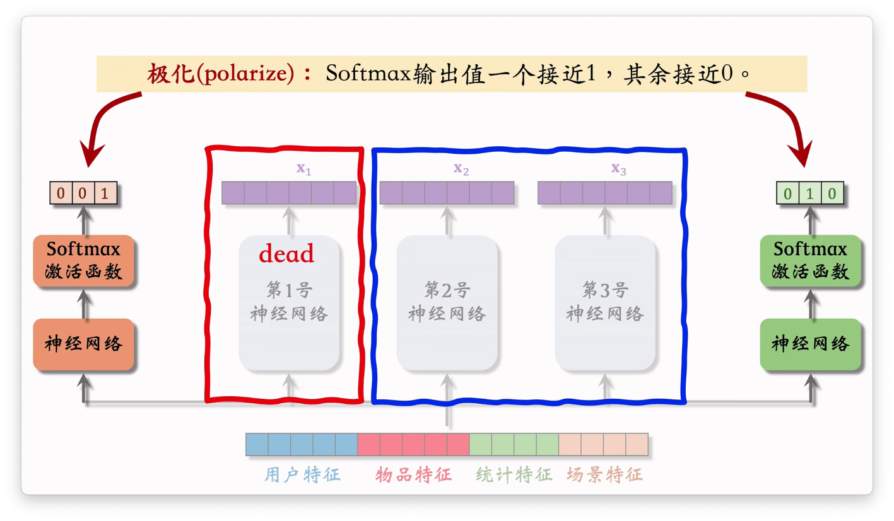
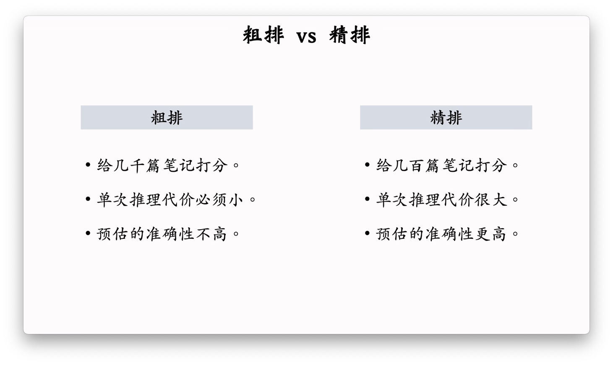

# 多目标模型（精排）

>参考文档：
>
>- [多目标学习在推荐系统的应用(MMOE/ESMM/PLE)](https://zhuanlan.zhihu.com/p/291406172)

目标：在推荐系统中，需要对推荐信息预测点击率，点赞率等指标进行预测用来评价推荐系统的好坏。对于这种有多个目标的模型，不能简单使用一个神经网络模型来实现。所以就衍生出了下面的多目标模型。

## 多任务学习-Shared-Bottom Multi-task Model

### 模型训练

#### 减少负样本

在训练时，会通过对负样本降采样的方式来减少训练的开销。

### 预估值校准

对于负样本降采样之后，又会带来预估点击率造成影响。预估点击率会大于真实的点击率。

#### 如何校准

### 存在缺陷

对于输出的多目标之间有强相关性时候，这种hard-paramter-shared（共享同一个基底）可以发挥其优势。

但是对于若关联目标，该结构会影响输出的结果。

## Multi-gate Mixture-of-Experts(MMoE)

对比上面的Shared-Bottom 模型，将 Shared-Bottom 拆分为多个专家模型，分别计算出特征。然后利用门控网络控制每一个专家模型的权重重，来实现对于任务项的估计处理。

1. 多个专业家神经网络去提取初始用户特征

2. 使用多个gate 来平衡专家提取的注意力，然后对专家向量加权平均传入神经网络中，实现对相关指标（点击率，点赞率等）的预测

### 极化（polarize）

极化：门控网络的输出值一个接近 1，其余接近 0 导致部分专家特征实际上没有被利用。

#### 解决极化问题

类似于召回中自监督的思路，使用 dropout 的方式来避免极化的问题

# 融合预估分数

不直接使用每一项的打分，而是使用排名来进行分数融合

# 视频播放建模

主要讨论视频播放时长和完播率这两个指标。

## 播放时长

1. 使用$z$作为播放时长项的输出
2. 在训练中，使用 SigMod 二分作为训练预估项，$y$是正样本，$t$是播放时长。使用$p$和$y$来构建代价函数训练模型。

3. 在训练中目标是$p=y$，那么该模型输出的播放时长为$exp（z）$

4. p 在训练模型之后就没有用了，仅仅是用于构建代价函数的中间变量

### 具体流程

## 视频完播

### 回归方法

 

### 二分类方法

### 融合完播率

直接将完播率加入到融分公式中，对长视频不公平。需要利用视频时长的函数$f$来对完播率进行调整

# 排序模型的特征

## 特征类型

### 用户画像

### 物品画像

### 用户统计特征

除用户自身特点所构成的用户画像以外的。用户最近的一些行为特征：

### 笔记统计特征

笔记发布之后的总结得到的特征：

### 场景特征

## 特征处理方式

- 离散特征：做 embedding
- 连续特征 ：分桶变成离散特征

## 排序流程

# 粗排模型

## 粗排与精排

## 粗排三塔模型

- 训练起来是端到端训练
- 处于前期融合和后期融合之间

 

粗排模型的大部分计算时耗都在这一部分，计算你的开销大于交叉特征塔的开销。

### 三塔模型的推理

