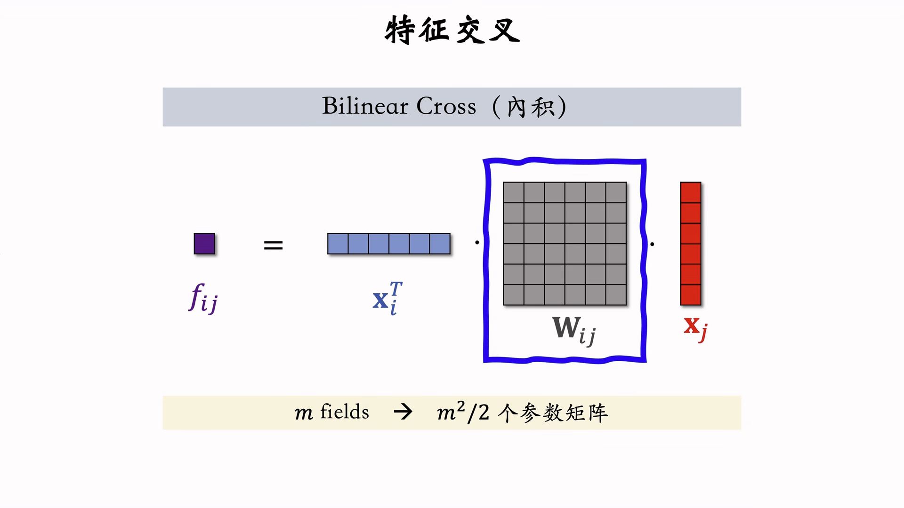

# 特征交叉

通过两个或者多个特征组合（非线性的组合）行程新的特征，称为特征交叉。

特征交叉可以去挖掘数据中存在的潜在特征，增强模型的预测能力。

## 交叉特征和神经网络

- **交叉特征：**是**显式**交叉分支，通过人工构造出有解释性质的交叉特征，在稀疏数据中能快速定位关键交叉模式具有明确的物理意义（如“用户年龄×商品价格”），可解释性强。
- **神经网络**：是**隐式**的交叉特征，通过多层非线性变换自动学习高阶交互，但无法明确解析交互形式（如DNN学到的可能是*x*12+sin(*x*2)等复杂组合）。能隐式学习更高阶、更复杂的交互（如四阶及以上），但需要大量数据且可能学习到冗余组合。

两者关系可类比“**人工设计规则**”与“**数据驱动学习**”的结合：

- **高阶交叉**像专家经验，精准但覆盖有限；
- **神经网络**像自主学习，泛化性强但需数据支撑。

通过交叉特征和神经网络的配合，可以强化人工手动提取出来的特征，再放到神经网络中增强预测效果，平衡两者优势。

# Factorized machine（FM）

使用二阶来实现不同特征之间的交叉融合。

参数数量更小，推理的计算量更小，不容易出现过拟合。

FM 是线性回归的替代品，只需要在线性回环后面添加交叉项就可以了。效果显著比线性模型好。

# 深度交叉网络

## 交叉层

## 交叉网络（Cross Network）

## 深度交叉网络（DCN）

### 优点

**自动高阶交叉**：深度交叉层通过数学公式（如$x_l+1=x_0⊙(W_{l}x_l+b_{l})+x_{l}$*）显式构造特征组合，无需人工设计。例如，L层交叉网络可生成最高*L+1阶的特征交互

|   **维度**   | **传统方法（如FM、人工交叉）** |       **深度交叉层**       |
| :----------: | :----------------------------: | :------------------------: |
| **特征工程** |     依赖人工设计，耗时耗力     |  全自动学习，无需人工干预  |
| **交叉阶数** |      通常限于二阶（如FM）      | 支持**任意高阶**，灵活可控 |
| **计算效率** |        高阶交叉参数爆炸        |  线性复杂度，工业级可扩展  |

MMoE 中的专家神经网络也可以是 DCN 模型。

#  LHUC

## 语音系统中的LHUC

说话者特征的神经网络，输出的特征每一个元素都介于 0-2 （Sigmoid * 2）之间，可以实现放大某一些特征，相对缩小一些语音特征做个性化。

## 推荐系统中的LHUC（PPNet）

> 参考文档
>
> - [推荐系统-14-特征交叉-4.3-LHUC&PPNet](https://mp.weixin.qq.com/s?__biz=MzkwODI1OTE1Nw==&mid=2247484291&idx=1&sn=56f1c4acf80b80a283e3fd83b3e2e666&chksm=c0cdf9b9f7ba70af271a14eef757105a78242e04e9683be9a781d7cf6af6f3324b7021b97fd2#rd)

- 语音特征变成了物品特征
- 说话者特征变成了用户特征

### 优点

**个性化特征增强**：
通过用户/物品ID等强个性化特征（如`uid`, `photo_id`）生成动态权重，对公共特征（如价格、类别）进行缩放。用户特征向量经过圣经网络处理之后得到物品特征的强化的向量，以此来自定义得增强用户需要的特征向量，放大重要特征、抑制无关特征。

**解决数据分布差异**：

传统DNN共享参数难以处理用户群体或场景的分布差异（如价格敏感度不同），LHUC通过动态权重实现细粒度个性化，无需针对每个用户单独微调

# SENet（[Squeeze-and-Excitation Network](https://zhida.zhihu.com/search?content_id=162430494&content_type=Article&match_order=1&q=Squeeze-and-Excitation+Network&zhida_source=entity) ）

> 参考文档
>
> - [【注意力机制】通道上的注意力：SENet论文笔记](https://zhuanlan.zhihu.com/p/334349672)

在原有的特征中提取出特征的权重（通过池化和全连接层等方法），提取出不同特征的关注度 $m \times 1$（也就是注意力机制）。与原有的Embedding 相乘，增强对应的特征向量。

注意力机制，SENet 会对特征做加权处理，重要的特征（也就是一个 field ）权重高，不重要的权重低。

## field 特征交叉

### field 进行特征交叉的方法

#### Cross

#### Bilinear Cross

