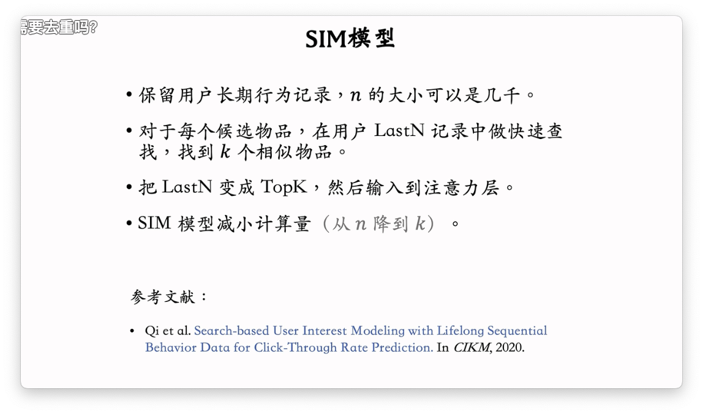

# 行为序列（LastN）

最近交互过的物品序列，使用该序列可以用于挖掘用户兴趣偏好，以此来预测用户未来的行为，推荐合适的物品。

## 构建用户行为序列特征

取 lastN 的向量特征相加取平均或者是引入注意力机制，可以得到某个指标的 Embedding。

再将该 Embedding 用于召回，精排等过程。可以推荐给用户其最近感兴趣的物品。

# 推荐系统模型中的注意力机制

> 参考文档：
>
> - [深入理解推荐系统：推荐系统中的attention机制](https://zhuanlan.zhihu.com/p/628432237)

# DIN 模型

> 参考文档：
>
> - [【总结】推荐系统——精排篇【3】DIN/DIEN/BST/DSIN/MIMN/SIM/CAN](https://www.zhihu.com/tardis/zm/art/433135805?source_id=1003)

目标：

用户的历史行为，其实只和某一些步骤是相关联的。比如说，现在想要预测推荐给用户一件大衣广告，用户会点击购买的概率。那么购买的概率其实是和前面购买的杯子是没有什么关联的。所以就引出了 DIN 这个基于注意力机制的加权处理方法，弱化没有关联的历史序列 对于推荐的影响。

## 模型实现

候选物品：

- 在召回中提取出来的物品，是粗排步骤的候选物品，粗排步骤需要给这些候选物品打分过滤。
- 粗排步骤中，过滤出来的几百个物品是精排步骤的的候选物品

使用 cosine 或者是内积作为 LastN 和候选物品的**相似度**，然后再使用相似度来作为权重计算出加权和之后的特征向量。加权和处理出来的特征向量，会用于精排模型中的 concat 输入。

## 简单平均和注意力机制

> ## 为什么注意力机制不适用于三塔和双塔模型，因为用户塔不能看到候选物品？？？（这个感觉有点扯）
>
> - 注意力机制与双塔/三塔模型的矛盾本质是**表达能力与效率的权衡**。注意力机制破坏了这个效率与平衡的关系。在业界通常使用 SENet 来说实现特征的加权。
> - 对于双塔模型和三塔模型来说，如果引入注意力机制，因为需要涉及到候选向量，所以会导致计算的开销呈指数级增长，因为每一个候选的物品向量都需要和所有的用户序列处理一遍计算注意力权重向量
> - 而简单平均的话并不需要，只需要对用户序列遍历一遍就好了。

## 存在问题

# SIM 模型

**目标：**

由于 DIM 在增加用户行为序列的时候，这种暴力的方法时耗也会随之增加。所以希望，可以在增加用户序列的同时，可以控制时间的开销。所以有了 SIM 模型的出现。

## 具体步骤

### 第一步：查找 Top K

- Soft Search 的搜索比较难，效果更好
- hard Search 实现简单。

### 第二步：注意力机制

这样计算出来的向量，与使用完整用户行为序列计算出来的加权向量几乎没有变化，因为被排除掉的用户行为序列和候选物品之间的相似度也是几乎为 0。

#### 引入时间信息

这里拼接之后的 TopK 向量应该还会使用升降维的方法，来调节向量的维度大小吧？

> **为什么 SIM 使用时间信息，而 DIN 不需要使用时间信息？**
>
> 因为 DIN 的序列不长，所以不需要引入时间信息。而 SIM 的序列到达了几千。
>
> 

## 结论

